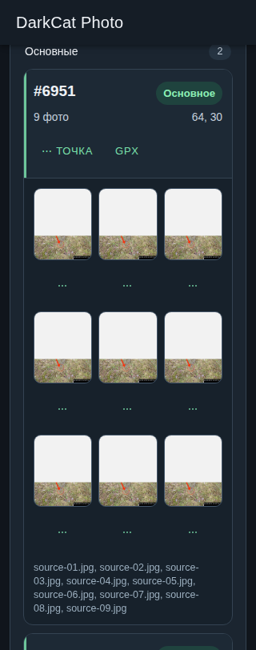
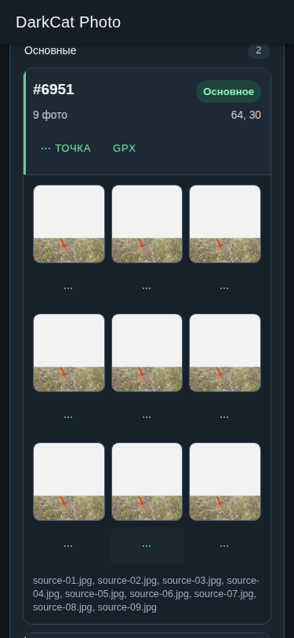
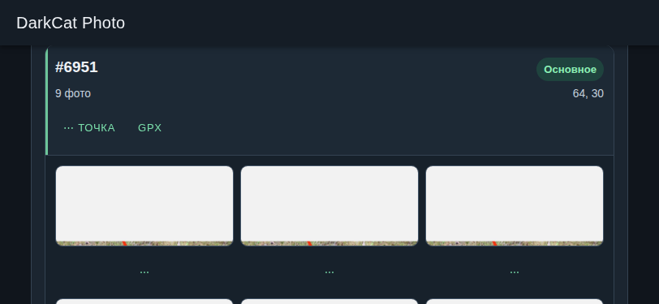
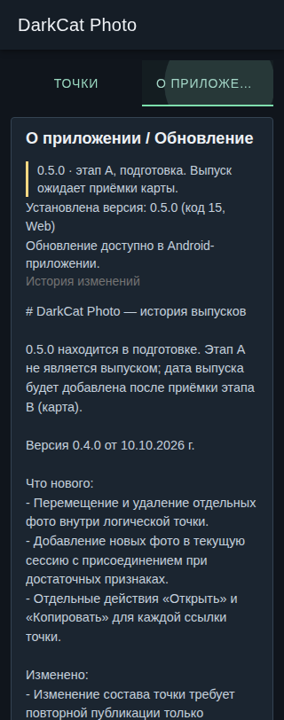
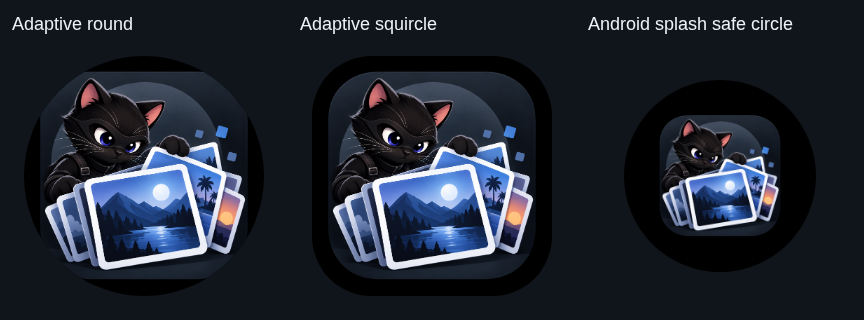

# DarkCat Photo 0.5.0 — checkpoint Stage A

Задание: [agent-dispatch#550](https://github.com/dedtsss/agent-dispatch/issues/550).
Каноническая [execution revision](https://github.com/dedtsss/agent-dispatch/issues/550#issuecomment-6100354358), [полная ревизия](https://github.com/dedtsss/agent-dispatch/issues/550#issuecomment-6100302415).
Та же ветка `manual/darkfoto-mvp-550`, [PR #52](https://github.com/dedtsss/distance-points-on-the-map/pull/52), выпущенный baseline `b196ab88d1bd98020ac23cf34f772a11f652e7f4`.

**Stage A не является выпуском.** Подготовлены версия 0.5.0 и versionCode 15; `build-info.json` явно содержит `releaseReady: false`. Application ID, постоянный сертификат проверки обновлений и существующий путь release tags не изменены. Production signing, merge и publication не выполняются. Stage B требует staged production map credential и успешного preflight; вкладки карты и provider/network integration в Stage A нет.

## Реализовано

- Полезный заголовок точки сохранён. Девять фото образуют мобильную сетку 3×3. Превью открывает точно выбранное фото; свайп/кнопки/стрелки перемещаются только между участниками этой точки. При увеличении жест панорамирует изображение. Компактное меню точки сохраняет split/merge/copy/remove; у каждого превью отдельные move/remove действия.
- В 0.4.0 удаление хранило один глобальный snapshot и кнопку над списком; новые удаления хранят стек на самой точке, включая Android recovery. Три последовательных удаления возвращаются в обратном порядке возле карточки. Восстановление не перезаписывает последующие append/move и не оживляет старые URL. Representatives, Main/Reserve/Review, TXT/copy/GPX и publication вычисляются из актуального состава. Final-member removal остаётся recoverable placeholder.
- Android SAF export: выбранная пользователем папка → одна новая папка сессии → папки активных точек → metadata-stripped JPEG и TXT. Последовательные имена стабильны по порядку исходных членов; повторяющиеся индексы получают отдельный суффикс папки. TXT содержит известные индекс/identity, координаты, статус, число фото, Session/Color/Packaging/Comment и локальные имена. Originals не изменяются. Приватный staging, `.incomplete-*`, reread SHA-256, final rename и bounded rollback предотвращают ложный успех. Неподдерживаемый provider или ошибка записи явно останавливают экспорт; неудалённая неполная папка названа в ошибке.
- Четыре локальные истории по 10 различных непустых значений, MRU-first filtering на focus/type, keyboard selection, свободное редактирование и удаление выбранного сохранённого значения. Истории не отправляются на сервер.
- DarkCat Photo на launcher/header/About/update/download notifications/clipboard/share/имени экспортов; «Точки» вместо «Фото». Технические package/plugin/release-tag identifiers сохранены для continuity.
- `CHANGELOG.md` — единый источник русской истории в About/update. Подтверждены только выпуски 0.4.0, 0.3.9, 0.3.8 по связанным GitHub Releases. `scripts/release-notes.mjs` извлекает ровно ту же запись для будущей публикации и отклоняет отсутствующую/неполную запись. 0.5.0 пока без придуманной даты/записи о состоявшемся выпуске.
- [Аудит графики](resources/BRANDING-AUDIT.md): утверждённый 1254px master достаточен. Исходник и 20 launcher resources сохранены; 16 splash resources воспроизводимо получены из master без повторного resizing. Новая launch theme показывает утверждённого кота на тёмном фоне.

## Проверки checkpoint

- `cd darkfoto && npm test`: 56 unit tests; browser OCR; real JPEG OCR; полный регрессионный `browser-points.mjs`; `browser-stage-a.mjs`; попиксельная launcher/splash проверка. Финальные результаты и точный head опубликованы в PR/ledger.
- `cd darkfoto && npm run android:sync` (включает `npm run build`): PASS.
- `ANDROID_HOME=/home/codex/android-sdk ./gradlew :app:testDebugUnitTest :app:assembleDebug :app:assembleDebugAndroidTest assembleRelease --no-daemon -Dorg.gradle.jvmargs=-Xmx768m -Dorg.gradle.workers.max=2`: PASS. Native export transaction coverage: write/read-verification/rename failure, rollback failure, path traversal, incomplete sequence and duplicate destination. APK badging: `app.darkfoto.mvp`, `0.5.0`, `15`; `apksigner verify` отклоняет unsigned artifact (ожидаемый результат).
- Root `npm run build` и `npm run build:cloudflare`: PASS. `cd onion-drop && npm test`: PASS, 2 tests. `git diff --check`: PASS.
- Root локальный `npm test`: прежний сбой `scripts/test-index-ocr-fixtures.mjs:97`, `four-digit-leading-zero`, actual `null` vs expected `0123`. Тот же baseline failure уже зафиксирован в PR 0.4.0. Root `src/`/`scripts/` не изменены; результаты обычных Web/Android GitHub Actions на точном pushed head публикуются в PR/ledger отдельно.
- Browser acceptance при 320/375px portrait и 812×375 landscape: grid dimensions, no horizontal overflow, viewer 5/9 → 4↔5↔6, обе границы галереи, zoom-pan, три локальных restore, cleaned JPEG export с текущими именами/TXT и failure path, четыре MRU после restart/reload, название/две вкладки и точный canonical changelog. Reduced motion включён.

## Визуальные свидетельства

## Проверки владельца на физическом Android

- SAF destination selection/cancel, реальный provider с write/rename/delete, отсутствие места, повторный export и recovery после process restart. После выбора папки проверить JPEG/TXT на устройстве и неизменность исходников.
- EXIF orientation (особенно 3/6/8), камера/галерея конкретного устройства, multi-touch pinch, IME и максимальный системный размер шрифта.
- OEM round/squircle launcher, cold/warm splash, URL/clipboard/TXT/GPX share handoff и updater install handoff. Production signer не использовался в этом checkpoint.

## Решения и reuse

Использованы существующий Ionic action sheet/viewer, браузерный privacy cleaner и Android built-in DocumentsContract/SAF вместо новой файловой зависимости или storage backend. [Официальный SAF guide](https://developer.android.com/training/data-storage/shared/documents-files) подтверждает user-selected tree и provider-dependent operations; [Ionic action sheet](https://ionicframework.com/docs/api/action-sheet) уже есть в стеке. Небольшой native adapter необходим для дерева сессии и проверяемого commit/rollback нескольких файлов: существующий одиночный TXT save/share не создаёт такое дерево. Транзакция отделена от DocumentsContract для failure tests. [SplashScreen API](https://developer.android.com/develop/ui/views/launch/splash-screen) и существующая compat library используются без новой зависимости. Карта не исследовалась/не подключалась повторно: принятое credential-gated решение execution revision сохранено.

Следующее действие: владелец staging production map credential → точный route preflight → Stage B в том же Issue/branch/PR → final acceptance 0.5.0/code15. До этого terminal state всей ревизии — **PARTIAL**.
